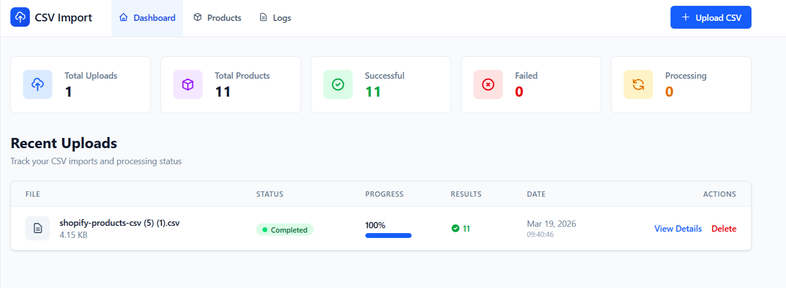
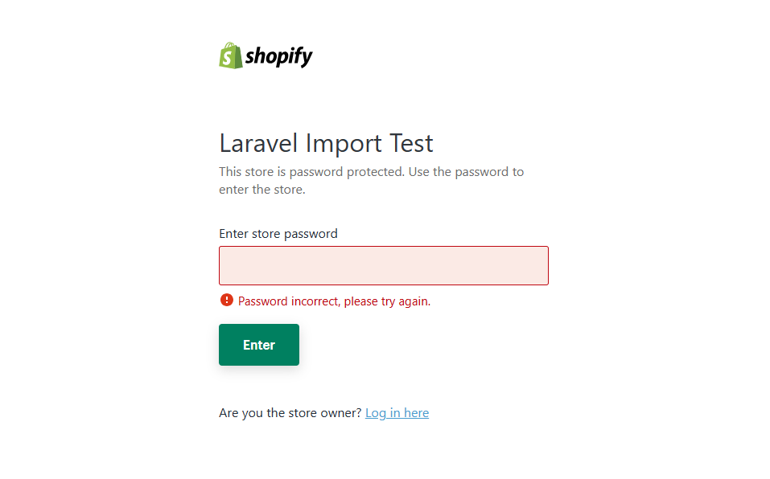

# CSV to Shopify Product Import System

A Laravel 12 application that allows users to upload CSV files containing product data, processes them asynchronously using Laravel queues, and provides comprehensive tracking with modern UI and GraphQL API.

## Core Technologies

-   **Backend:** Laravel 12
-   **Frontend:** Blade Templates, Tailwind CSS (CDN)
-   **Database:** MySQL 8.0+
-   **Queue System:** Database Driver
-   **CSV Parser:** `league/csv`
-   **GraphQL API:** `nuwave/lighthouse`

---

## 1. Installation and Setup

Follow these steps to get the application running on your local machine.

### Prerequisites

-   PHP >= 8.2
-   Composer
-   MySQL 8.0+
-   Git

### Step-by-Step Guide

1.  **Clone the Repository**
    ```bash
    git clone https://github.com/larainfo1050/laravel-shopify.git
    cd laravel-shopify
    ```

2.  **Install Dependencies**
    ```bash
    composer install
    ```

3.  **Environment Configuration**
    Create your environment file and generate an application key.
    ```bash
    copy .env.example .env
    php artisan key:generate
    ```

4.  **Configure Database**
    Open the `.env` file and update the database connection details.
    ```dotenv
    DB_CONNECTION=mysql
    DB_HOST=127.0.0.1
    DB_PORT=3306
    DB_DATABASE=laravel_shopify
    DB_USERNAME=root
    DB_PASSWORD=your_password_here
    ```

    **Create Database:**
    ```bash
    mysql -u root -p
    CREATE DATABASE laravel_shopify CHARACTER SET utf8mb4 COLLATE utf8mb4_unicode_ci;
    EXIT;
    ```

5.  **Run Migrations**
    This will create all necessary tables (uploads, products, import_logs, jobs).
    ```bash
    php artisan migrate
    ```

6.  **Create Upload Directory**
    **Windows:**
    ```bash
    mkdir storage\app\uploads
    ```
    
    **Linux/Mac:**
    ```bash
    mkdir -p storage/app/uploads
    chmod -R 775 storage/app/uploads
    ```

7.  **Start the Servers**
    Open **3 separate terminals** and run:
    
    ```bash
    # Terminal 1: Laravel Server
    php artisan serve

    # Terminal 2: Queue Worker (Required for CSV processing!)
    php artisan queue:work --tries=3 --timeout=300

    # Terminal 3 (Optional): Queue Monitor
    php artisan queue:listen
    ```

The application will be available at **http://localhost:8000**  
GraphQL Playground at **http://localhost:8000/graphiql**

---

## 2. CSV Format

The system supports Shopify product export format with **21 columns**:

| Column | Description |
|--------|-------------|
| Handle | Unique product identifier |
| Title | Product name |
| Body (HTML) | Product description |
| Vendor | Brand/Manufacturer |
| Product Type | Category |
| Tags | Comma-separated tags |
| Published | TRUE/FALSE |
| Variant SKU | Stock keeping unit |
| Variant Price | Product price |
| Variant Compare At Price | Original price |
| Variant Requires Shipping | TRUE/FALSE |
| Variant Taxable | TRUE/FALSE |
| Variant Inventory Tracker | shopify/none |
| Variant Inventory Qty | Stock quantity |
| Variant Inventory Policy | deny/continue |
| Variant Fulfillment Service | manual/automatic |
| Variant Weight | Product weight |
| Variant Weight Unit | kg/lb/g |
| Image Src | Image URL |
| Image Position | Sort order |
| Image Alt Text | Image description |

**Sample CSV file included:** `shopify-products-csv.txt` (10 test products)

---

## 3. Application Features & Workflow

### Dashboard Overview

The main dashboard provides real-time statistics and upload management.

**Key Metrics:**
- Total Uploads
- Total Products
- Successful Imports
- Failed Imports
- Currently Processing



**[Watch Full Demo Video](./docs/Upload%20CSV%20-%20CSV%20Import%20System.mp4)** (Click to download)

**Features:**
- Live progress bars for each upload
- Status badges (Pending, Processing, Completed, Failed)
- File details (name, size, date)
- Success/failure counts per upload
- Quick delete functionality

### Upload CSV File

1. Navigate to **Upload CSV** in the navigation menu
2. Drag and drop your CSV file (or click to browse)
3. Supported formats: `.csv`, `.txt` (max 10MB)
4. Click **Upload and Process**
5. Automatically redirected to dashboard

**The system will:**
- Validate file format
- Store file securely in `storage/app/uploads/`
- Create upload record in database
- Dispatch async job to queue
- Process products in background

### Upload Details Page

Click any upload to view comprehensive details:

**Upload Summary:**
- File information
- Current status
- Progress percentage
- Statistics grid (Total/Successful/Failed/Processed)

**Products Table:**
- All imported products
- Handle, Title, Vendor, Price, Stock
- Import status for each product
- Error messages if any

**Import Logs:**
- Expandable log entries
- Level badges (Info, Success, Warning, Error)
- JSON context viewer
- Timestamp tracking

### Products Management

Browse and filter all imported products at `/products`


## 4. GraphQL API

Full CRUD API available at: **http://127.0.0.1:8000/graphiql**

### Quick Start Examples

#### Get All Products
```graphql
mutation CreateProduct {
  createProduct(
    upload_id: 1
    handle: "test-product-001"
    title: "Test Product"
    published: true
    variant_price: 19.99
    variant_inventory_qty: 100
  ) {
    id
    handle
    title
    variant_price
    variant_inventory_qty
    created_at
  }
}

mutation CreateFullProduct {
  createProduct(
    upload_id: 1
    handle: "premium-blue-shirt"
    title: "Premium Blue Shirt"
    body_html: "<p>High quality cotton shirt in ocean blue</p>"
    vendor: "Fashion Store"
    product_type: "Apparel"
    tags: "shirt, blue, premium, cotton"
    published: true
    variant_sku: "SHIRT-BLUE-001"
    variant_price: 45.99
    variant_compare_at_price: 59.99
    variant_requires_shipping: true
    variant_taxable: true
    variant_inventory_tracker: "shopify"
    variant_inventory_qty: 75
    variant_inventory_policy: "deny"
    variant_fulfillment_service: "manual"
    variant_weight: 0.5
    variant_weight_unit: "kg"
    image_src: "https://example.com/blue-shirt.jpg"
    image_position: 1
    image_alt_text: "Premium Blue Cotton Shirt"
    import_status: "successful"
  ) {
    id
    handle
    title
    vendor
    variant_price
    variant_inventory_qty
    published
    created_at
  }
}

mutation UpdateFull {
  updateProduct(
    id: 1
    handle: "updated-handle"
    title: "Updated Title"
    body_html: "<p>Updated body</p>"
    vendor: "New Vendor"
    product_type: "New Type"
    tags: "tag1, tag2"
    published: true
    variant_sku: "NEW-SKU-001"
    variant_price: 99.99
    variant_compare_at_price: 129.99
    variant_requires_shipping: true
    variant_taxable: true
    variant_inventory_tracker: "shopify"
    variant_inventory_qty: 200
    variant_inventory_policy: "continue"
    variant_fulfillment_service: "manual"
    variant_weight: 1.5
    variant_weight_unit: "kg"
    image_src: "https://example.com/new-image.jpg"
    image_position: 1
    image_alt_text: "New Image"
    import_status: "successful"
  ) {
    id
    handle
    title
    variant_price
    variant_inventory_qty
    updated_at
  }
}

query GetAllProducts {
  products {
    id
    handle
    title
    vendor
    variant_price
    variant_inventory_qty
    published
    import_status
    created_at
  }
}

query GetProduct {
  product(id: 1) {
    id
    handle
    title
    body_html
    vendor
    product_type
    tags
    published
    variant_sku
    variant_price
    variant_compare_at_price
    variant_requires_shipping
    variant_taxable
    variant_inventory_tracker
    variant_inventory_qty
    variant_inventory_policy
    variant_fulfillment_service
    variant_weight
    variant_weight_unit
    image_src
    image_position
    image_alt_text
    import_status
    error_message
    created_at
    updated_at
    upload {
      id
      original_filename
      status
    }
  }
}
mutation UpdatePrice {
  updateProduct(
    id: 1
    variant_price: 29.99
  ) {
    id
    handle
    title
    variant_price
    updated_at
  }
}
```
## ⚠️ Important Note: No Shopify API Integration

**This project does NOT integrate with Shopify API.** 

